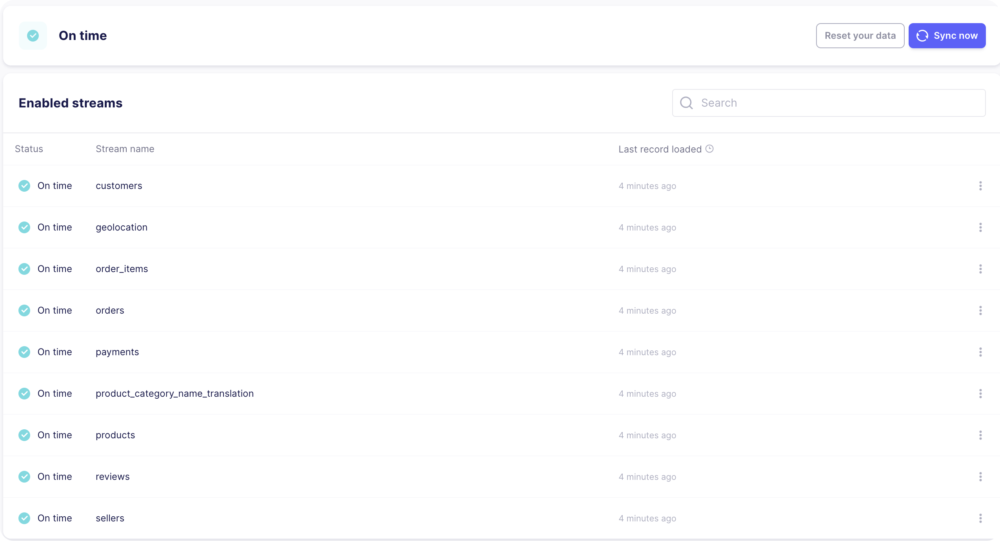
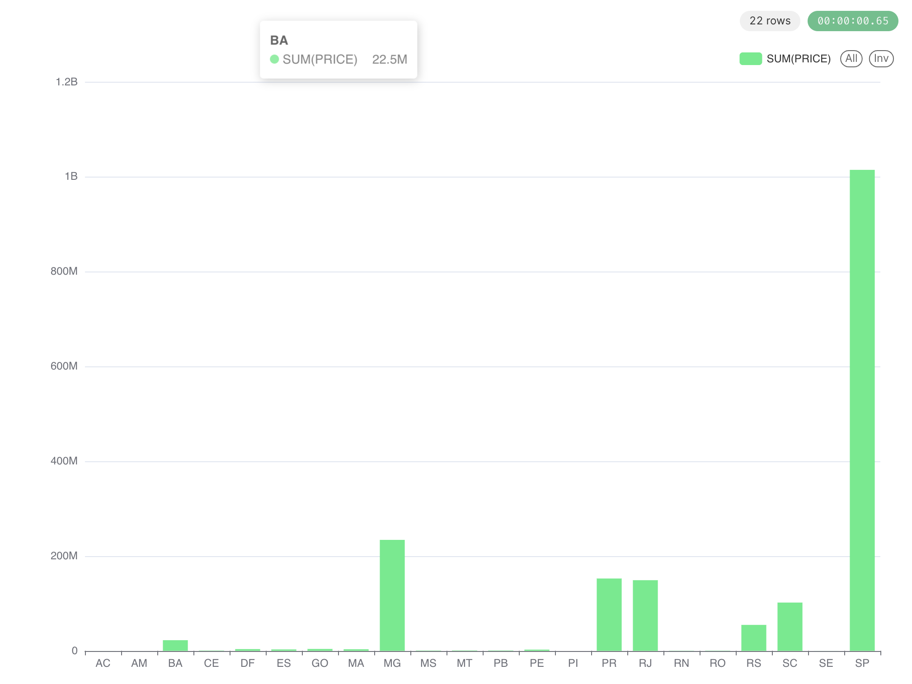

# Projet Data Engineering : Brazilian Ecommerce data ETL


## Project description


## Data source

Test source files: https://www.kaggle.com/datasets/burayamail/brazilian-ecommerce-analyses-v2/data, you can use your own files, because this dataset has many problems: such as order_id incorrect in the order_times csv, etc ...

## Architecture
GCS(CSV files) ----> Cloud SQL PostgreSQL ----> in Collecte (Dagster)  ----> Snowflake (Stockage)  ---->  dbt (Transform) ----> Superset (BI/Viz) 


## 1. Simulate a Cloud SQL PostgreSQL

1. Create a new bucket, then a folder for raw data, a folder for processed folder and for scrips.
2. Put all csv file that we just download in this bucket
3. Update the script `import_csv_tocloud.sh` which in the `./scripts` folde, then put it into the script folder in your bucket
4. Open Cloud Shell and use gsutil command to download the script to the vm `gsutil cp gs://BUCKET_FOLDER/SCRIPT_FOLDER/import_csv_to_cloudsql.sh ./import_csv_to_cloudsql.sh`
5. Grant execution permission to th script file `chmod + x import_csv_to_cloudsql.sh`
6. Go to Cloud SQL PostgreSQL, create an instance and a database for the projet in the Cloud SQL instance
7. Open Cloud SQL Studio page and create tables in the database (SQL in the `./scripts` folder, I've removed all foreign keys and some primary keys due to duplicated keys or other problems)
8. Grant `Storage Object Viewer` of the bucket to your Cloud SQL service account
9. Execute the script `import_csv_tocloud.sh` to remove headers of csv files to Cloud SQL

**Note**: If you don't want use a cloud based sql server for the source you can place csv files n the `seed`folder then use `dbt seed` command to populate tables


## 2. Output configurations ()
1. Create or use an existing account Snowflake
2. Create an Warehouse 
3. Create a database for this project
4. Update the section Snowflake in `.env` file (get account-indenfitifer in Account -> View account details )

## 3. Configuration Airbyte for data transfer

1. Create readonly user for Airbyte in database
```sql
-- Create an readonly user in the Clouo SQL PostgreSQL database for Airbyte and grant select permissions
CREATE USER <user_name> PASSWORD 'your_password_here';
GRANT USAGE ON SCHEMA <schema_name> TO <user_name>;
GRANT SELECT ON ALL TABLES IN SCHEMA <schema_name> TO <user_name>;
ALTER DEFAULT PRIVILEGES IN SCHEMA <schema_name> GRANT SELECT ON TABLES TO <user_name>;
```

2. Add a network with your IP address in the `Authorized networks` section
3. Go to `./airbyte` create a source connection, then search for PostgreSQL, fill out the IP, port, username, password. And chose SSL Modes with require and Detect Changes with Xmin System Column in Advanced secrtion `then Test and Save`.
4. Create a destination `Snowflake` connector, you can use this request to create role, user, database, warehouse and permissions


```SQL
-- set variables (these need to be uppercase)
set airbyte_role = 'AIRBYTE_ROLE';
set airbyte_username = 'AIRBYTE_USER';
set airbyte_warehouse = 'AIRBYTE_WAREHOUSE';
set airbyte_database = 'AIRBYTE_DATABASE';
set airbyte_schema = 'AIRBYTE_SCHEMA';

-- set user password
set airbyte_password = 'password';

begin;

-- create Airbyte role
use role securityadmin;
create role if not exists identifier($airbyte_role);
grant role identifier($airbyte_role) to role SYSADMIN;

-- create Airbyte user
create user if not exists identifier($airbyte_username)
password = $airbyte_password
default_role = $airbyte_role
default_warehouse = $airbyte_warehouse;

grant role identifier($airbyte_role) to user identifier($airbyte_username);

-- change role to sysadmin for warehouse / database steps
use role sysadmin;

-- create Airbyte warehouse
create warehouse if not exists identifier($airbyte_warehouse)
warehouse_size = xsmall
warehouse_type = standard
auto_suspend = 60
auto_resume = true
initially_suspended = true;

-- create Airbyte database
create database if not exists identifier($airbyte_database);

-- grant Airbyte warehouse access
grant USAGE
on warehouse identifier($airbyte_warehouse)
to role identifier($airbyte_role);

-- grant Airbyte database access
grant OWNERSHIP
on database identifier($airbyte_database)
to role identifier($airbyte_role);

commit;

begin;

USE DATABASE identifier($airbyte_database);

-- create schema for Airbyte data
CREATE SCHEMA IF NOT EXISTS identifier($airbyte_schema);

commit;

begin;

-- grant Airbyte schema access
grant OWNERSHIP
on schema identifier($airbyte_schema)
to role identifier($airbyte_role);

commit;
```
5. Create a connection use PostgreSQL connector and Snowflake connector and sync data to Snowflake, if you want just sync on time chose `Manuel` then run `docker-compose down` in `./airbyte` folder




## 4. DBT Section
Build your own models in `./models` and then run `docker-compose exec dbt dbt run` to create table ou views

## 5. Orchestration Dagster
Dagster is orchestration tool that can integrate with DBT, here I just have a easy example to run and test command with DBT

## 6. Superset
If you've build your models, you can move to `./superset` folder, fill out the `.env` and run `docker-compose up`

1. Create a connection with Snowflake and fill all the information of your configuration Snowflake
2. Create a Dataset with DATABASE, SCHEMA and TABLE
3. Create a new chart

This is an example you can get in Superset 


4. You can also create a dashboard and share it with your team members
